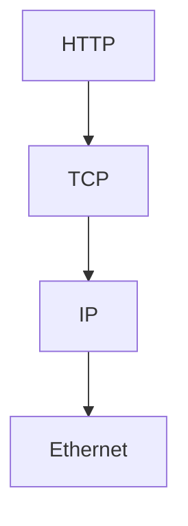

# OSI Model

## Layer 1 Physical
copper, cable, fiber obtic, *NIC*
NIC = Network Interface Card : stored MAC address

## Layer 2 Data
Ethernet, MAC address, LAN

*Ethernet Frame*

```mermaid
flowchart TD
  HTTP --> TCP
  TCP --> IP
  IP --> Ethernet
```

